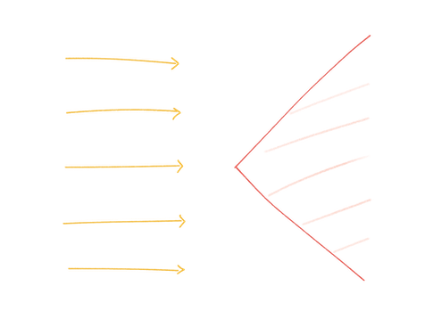
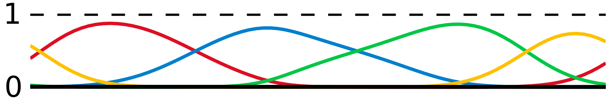

# 0323 流形：例子与基本思想

 $\newcommand{\supp}{\operatorname{supp}}$ 

本习题课介绍微分流形，常见的参考书如 do Carmo, Spivak。

## 直观例子

!!! ex "可展曲面"

    一张纸无论如何弯折，如果不出现折痕，总有一个方向是平的。（可用校园卡演示）

    反之，乒乓球无法被摊开到平面上。

    这个物理过程虽然复杂，但可做如下简单的抽象。
    直观上，纸本身是平的，这是纸的内蕴属性 (intrinsic)。
    纸所在的空间是平的，这是空间的内蕴属性。
    纸在空间中的形变，可由两个正交方向上的弯曲程度刻画，这是纸在空间中的外禀 (extrinsic) 属性。制约这三者的关系为 Gauss Codazzi 方程。

!!! ex "盈缺与散敛"

    考虑一束平行的光线穿过一个缺陷角：

    * 缺角 $<2\pi$，光线倾向于汇聚，能覆盖整个空间，相交的点构成低维的闭集；

    * 盈角 $>2\pi$，光线倾向于发散，无法覆盖整个空间。

    

    从中我们可以观察到如下现象：如果尝试用两族正交的直线组成笛卡尔坐标来描述一个曲面，

    * 有时需要多个笛卡尔坐标来完整描述；

    * 不完备/奇点：光线可能会消失——测地线无法延拓，Cauchy 列不收敛；

    * 散焦点 (conjugate point, focal point, cut locus, caustics, ...实际可分为两类)：笛卡尔坐标能描述的区域的边界——测地流构造的微分同胚失效的地方，测地线相交的地方，Jacobi field 的奇点。

        * 彩虹的位置即为散焦点。

    !!! remark

        光滑版本为球面与双曲平面。而这个例子把曲率集中到了一个锥形奇点 (conical singularity) 上。

        平行光线的推广为（从子集出发的）测地流，在现实中的应用之一为光追算法。

        这个例子描述的几何可被实现为 Einstein 引力理论中，2+1 维点粒子的引力场的空间截面。2+1 维局域渐近平直时空中不存在黑洞（或者说事件视界的半径为 0）。

            此处应有黑洞的嵌入图。

        对于正能量的物质分布，光线总是倾向于汇聚 (focusing theorem)。

!!! ex "Bertrand–Diguet–Puiseux theorem"

    \begin{equation}
        K\sim\lim_{r\to 0} \frac{\pi r^{2}-A(r)}{r^{4}}
    \end{equation}

    对于带诱导度规的单位球面，$A(r)=2\pi(1-\cos\theta)$，测地线长 $r=\theta$。

## 光滑流形

上述例子蕴含了太多结构。首先我们给出（光滑）流形的定义。

!!! def "Manifold"

    给定一个 Hausdorff，第二可数的拓扑空间 $M$，如果对于 $M$ 的每一点，都存在一个开邻域 $U$，使得 $U$ 同胚于 $\RR^{n}$ 的开集 $\phi:U\to\RR^{n}$，那么 $M$ 称为拓扑流形，$(U,\phi)$ 称为 $p$ 附近的坐标卡 (chart)，$n$ 称为维数。

    对于两个坐标卡 $(U,\phi)$ 和 $(V,\psi)$，如果 $\phi(U\cap V)$ 和 $\psi(U\cap V)$ 之间的两个同胚映射 $\phi\psi^{-1},\, \psi\phi^{-1}$ 是光滑同胚，那么这两个坐标卡称为（光滑）相容的，这些同胚称为坐标转换映射 (transition map)。

    一族覆盖 $M$ 的坐标卡 $\set{(U_{i},\phi_{i})}$ 如果是两两相容的，则称为 $M$ 上的一个图册 (atlas)。

!!! remark "第二可数性"

    第二可数性：拓扑存在可数基。
    在 Hausdorff 和联通的条件下可以替换为仿紧性 (paracompact)：开覆盖可加细为局部有限的开覆盖。

    这个技术条件用来防止流形过“大”，用以保证流形的整体可分割成可数个局部，例如单位分解 (partition of unity) 的存在性：$\sum_{i=1}^{\oo}f_{i}=1$，$f_{i}$ 光滑紧支撑在某个坐标卡内，且每一点附近均为有限求和，由此，函数或丛截面可分解或粘和为 $g=\sum f_{i}g$。下图取自 wiki。

    

图册和坐标卡的命名自然取自地图。在绘制地图的时候我们只能测量局部的地理信息，然后再把它们相容的拼接起来。

定义完图册后还需考虑图册之间的相容性：抽出一个图册中的坐标卡，检验是否与另一个图册中所有的坐标卡相容，进而遍历该图册中所有的坐标卡。如此，这两个图册可以合并到一个更大的图册中。

接下来定义（光滑）流形有两个处理方式，并无本质区别：1）该图册直接定义了该流形，再称相容的图册定义了等价的流形；2）先把所有可能的相容的图册合并起来，称该极大的图册定义了该流形。

!!! remark "一点历史：黑洞与图册"

    在二十世纪初，Einstein 建立的广义相对论一方面推动了物理的几何化，另一方面激发了 Riemannian 几何的发展，此外 Lorentzian 几何与数学相对论至今依然是一个活跃的领域。

    回顾 Einstein 的原始论文，会发现他花费了大量篇幅向读者介绍局部几何的计算——坐标变换、向量丛的变换、度规、联络、曲率等等，缺乏对整体拓扑的重视。

    这是一种“操作性”、“计算性”认识几何的方式，现今一些老式 GR 教科书中依然采取此种方式。

    这种观念在早期讨论黑洞的时候造成了一定的混淆。坐标奇点 vs. 测地奇点 vs. 曲率奇点。

!!! ex "常见例子"

    * $\RR^{n}$，其中的开集。

    * 光滑函数 $f:U\to\RR^{n}$ 的图 $\set{(x,f(x))\in U\xx \RR^{n}}$。

    * $M$ 中的开集。

    * 典型李群及其齐次空间。

        * $\glgroup(n,\RR)$ 作为行列式映射的逆像。

    * 乘积流形。

        * $T^{n}$

!!! ex "反例"

    * [长直线](https://en.wikipedia.org/wiki/Long_line_(topology))，$\omega_{1}$ 不可数份的区间首尾相接得到的光滑流形，see also [the MO question](https://mathoverflow.net/questions/21673/)。违背了第二可数性。

    * [两个原点的直线](https://en.wikipedia.org/wiki/Non-Hausdorff_manifold#Line_with_two_origins)，粘接了两个原点。第二可数但违背了 Hausdorff 性。

    * 带诱导拓扑的两条相交直线/自相交曲线，违背了局部 Euclidean 性。

!!! ex " $\CP^{1}$ "

    原点附近的复坐标 $z\in U$ 与无穷远点附近的 $w\in V$，转换映射为 $z=w^{-1}$。

    转换映射是复解析的，这是一个复流形。

这个例子 $\CP^{1}$ 启发我们，对局部模型和转移映射施加不同的条件，可以得到不同类型的流形。
另一个例子是带边流形 (manifold with boundary)，局部模型为半空间 $\RRgeq\xx\RR^{n-1}$。

!!! ex "带角流形"

    证明 $\set{(x,y)\given x\geq0,x y\geq0}$ 与 $\set{(x,y)\given x\geq0,x y\geq1}$ 作为带边拓扑流形同胚，但前者不是带边光滑流形。

    前者称为带角流形 (manifold with corner)。进一步可以引入不同余维数的角，这些角之间的包含关系可被抽象为 stratified space。更进一步，无论光滑与拓扑，可将带边角的流形定义为带额外 stratification 结构的流形。

## 空间、空间中的物体、空间上的量

一些构造是流形的光滑结构自带的：曲线、子流形、函数、切矢量、切空间、切丛与向量丛，特别的，微分形式。

在这之上指定额外的结构，给出不同的几何：

* 体积

* 长度 - Riemannian

    * 角度 - conformal

* 时间 - Lorentzian/Newton-Cartan/...

    * 因果 - conformal

* 复数乘法 - complex

* 动量 - symplectic

* ...