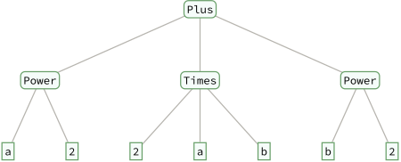

# Standard evaluation sequence

References:

* Mathematica documentation: `tutorial/Expressions`, `tutorial/Evaluation`, `tutorial/EvaluationOfExpressions`

## Moduli

在一些情况下，由相似对象构成的集合具有良好的几何结构，称之为模空间。
模空间的属性揭示了对象之间的关系。
借鉴微分几何的思想，模空间中的曲线代表了一族单参数的对象，即有限形变，而其切空间包含了独立的无穷小形变。
典型的例子是 Narain CFT 的模空间 [@Maloney:2020nni]：切向量对应精确平衡算子 (exactly marginal operator)，而测度对应着 CFT 的系综平均。

本文通过类比模空间来回顾 Mathematica 表达式的计算。

<center>

| Expr                                 | Moduli                            |
| :----------------------------------- | :-------------------------------- |
| expression `#!wl x0`                 | point $x_{0}$                     |
| rule `#!wl x0->x0+f0`                | tangent vector $f_{0}$ at $x_{0}$ |
| pattern `#!wl x_:>x+f(x)`            | vector field $f(x)$               |
| pattern condition `#!wl x_/;Q[x]==0` | constraint $Q(x)=0$               |
| evaluation `#!wl x0->x1->...->xn`    | flow from $x_{0}$ to $x_{n}$      |
| standard evaluation sequence         | a special flow                    |
| complexity                           | potential                         |
| neighborhood/locality                | ? [^neighbor]                     |

</center>

## Everything is an expression

本节回顾 Mathematica 的表达式，记所有符合语法的表达式构成的集合为 **Expr** [^expr]。在 Mathematica 中不存在原生的类型系统，一切对象皆为表达式 (expression)。这个设计原则可见文档 `#!wl guide/Expressions`：

> At the core of the Wolfram Language is the foundational idea that everything - data, programs, formulas, graphics, documents - can be represented as symbolic expressions. And it is this unifying concept that underlies the Wolfram Language's symbolic programming paradigm, and makes possible much of the unique power of the Wolfram Language and the Wolfram System.

表达式的结构可表示为树 (tree)，函数 `#!wl TreeForm` [^treeform] 给出表达式的树形式。可用 `#!wl Head, Level, Position, Part, Span, Length, Depth` 等函数访问表达式的内部结构。此外，函数 `#!wl LeafCount` 给出树的节点 (node) 或称叶子的总数，因此提供了一种表达式复杂度的度量。

* **原子：** 与树的结构相似，不存在非平凡子表达式的称为原子 (atom)，例如数、符号、字符串。

* **复合：** 树可以拼接，若干表达式可以复合为复杂度更高的表达式，此处复合 (composite) 指树的拼接，形如 `#!wl f0[f1,f2,...]`，类似于 operad [^operad]。

* **合成：** 树构成森林，对应于合成 (compound)，形如 `#!wl f1;f2;...`，类似于张量积。

例如：表达式 `#!wl a^2+2 a b+b^2` 的树形式为

<center>



</center>

## Evaluation

表达式的集合 **Expr** 是一个无结构的平凡集合。对表达式的计算 (evaluation) 可实现表达式之间的形变 (deformation)。当然，计算类似于离散动力系统，并无良好的微分结构。

特定对象 $x_0$ 的不同无穷小形变可记为 $x_0 \mapsto x_0 + \d_i x_0,\,  \d_i x_0\in TM_{x_0}$，例如有效作用量的形变为

\begin{equation}
    S_0\to S_0+\sum_i\intt{d^d x}\d g_i \op_i
    \, .
\end{equation}

形变切方向的类似物为规则 `#!wl Rule (->)`。表达式的子表达式的集合可以实现为

!!! wl ""

    ``` wl
    subexpr[expr_]:=Cases[expr,_,All];
    ```

例如 `#!wl expr0=f[g[h]]` 的子表达式为，

!!! wl ""

    ``` wl
    list=subexpr[expr0]
    ```

    ``` wl
    Out[] = {h,g[h],f[g[h]]}
    ```

由于 **Expr** 过大，将其简单截断为 `#!wl exprlist={a,b}`。改变表达式 `#!wl expr0` 的规则的集合可以实现为

!!! wl ""

    ``` wl
    exprlist={a,b};

    rulelist=Outer[Rule,list,exprlist]//Flatten
    ```

    ``` wl
    Out[] = {h->a,h->b,g[h]->a,g[h]->b,f[g[h]]->a,f[g[h]]->b}
    ```

函数 `#!wl Replace[expr_,rule_]` 会搜索 `#!wl expr_` 中匹配 `#!wl rule_` 的子表达式并进行替换，可实现表达式的形变，`#!wl expr0` 的全部形变为 [^neighbor]

!!! wl ""

    ``` wl
    Table[
        Replace[expr0,rule,All],
        {rule,rulelist}
    ]
    ```

    ``` wl
    Out[] = {f[g[a]],f[g[b]],f[a],f[b],a,b}
    ```

注意这里并不包含诸如 `#!wl g->a`的形变。若想实现这类形变，需启用 `#!wl Case|Replace` 的选项 `#!wl Heads->True`。另一种通用的方法是引入含有模式的延迟规则 `#!wl g[x_]:>a[x]`，此处模式 `#!wl x_` 用局部变量 `#!wl x` 指代 **Expr** 中的任意一个表达式，类似于 $\forall x\in M$。

!!! wl ""

    ``` wl
    Replace[expr0,g->a,All,Heads->True]

    Replace[expr0,g[x_]:>a[x],All]
    ```

    ``` wl
    Out[] = f[a[h]]

    Out[] = f[a[h]]
    ```

模式 `#!wl Pattern[name_,patt_]` 提供了全称量词的类似物。含有模式的延迟规则 `#!wl patt_:>target_` 可作用到 **Expr** 中的每一个表达式上，这类似于矢量场 $f(x)$ 在 $M$ 的每点指派无穷小形变。

\begin{equation}
x \mapsto x+ f(x), \, \forall x\in M
\, .
\end{equation}

需要指出的是，赋值函数 `#!wl Set (=), SetDelayed (:=), UpSet (^=), UpSetDelayed (^:=)` 等的作用是在 Mathematica 的全局规则库中添加指定的规则。

### Standard evaluation

在计算时，Mathematica 会遍历表达式 `#!wl expr=f0[f1,f2,...]` 的子结构，比对全局规则库进行模式匹配，重复这一步骤直到表达式的形式不变，称之为标准计算序列 (standard evaluation sequence)：

* 计算表达式的 `#!wl Head[expr]=f0`；
* 依次计算子表达式 `#!wl f1,f2,...`；
* 应用符号的属性；
* 应用用户定义进行计算，即利用规则进行替换；
* 应用内置定义进行计算；
* 重复上述步骤，直到表达式不再变化或溢出。

这类似于动力系统收敛到不动点或发散。

### Non-standard evaluation

计算依赖规则之间的顺序，类似于不同的矢量场不交换。因此选取合适的规则顺序方可得到目标表达式。

标准计算序列在特定场景并不合适，例如上面的子表达式一例中，如果表达式含有可被计算的部分，结果为

!!! wl ""

    ``` wl
    f=g;

    subexpr[f[1+1]]
    ```

    ``` wl
    Out[] = {2,g[2]}
    ```

这是因为在执行标准计算序列时，先计算 `#!wl f=g`，再计算 `#!wl g[1+1]=g[2]`，最后计算 `#!wl subexpr[g[2]]={2,g[2]}`。

若想得到 `#!wl f[1+1]` 的子表达式需要修改计算顺序，可用 `#!wl HoldFirst` 属性实现这一点：

!!! wl ""

    ``` wl
    subexpr2//Attributes={HoldFirst};

    subexpr2[expr_]:=Cases[Unevaluated@expr,subexpr_:>HoldForm@subexpr,All];
    ```

带有 `#!wl HoldFirst` 属性的 `#!wl subexpr2` 会保持输入 `#!wl f[1+1]` 不变，直接匹配 `#!wl subexpr2` 的下值。

!!! wl ""

    ``` wl
    subexpr2[f[1+1]]
    ```

    ``` wl
    Out[] = {1,1,1+1,f[1+1]}
    ```

Mathematica 提供了若干调整计算顺序的内置函数，相关的计算称为非标准计算 (non-standard evaluation)，例如

* `#!wl Hold` family

* `#!wl Inactive` family

* `#!wl Evaluate|Unevaluated`

* `#!wl Verbatim`

* `#!wl Defer`

[^neighbor]: Neighborhood: why use `#!wl Plus` in `#!wl x0->x0+f0` since there is no notion of linearity? How to tell whether two expressions are close enough? A possible answer is OOP.

[^expr]: The "size" of **Expr** is controlled by two objects: the collection of valid trees and the collection of node indices. Nodes can be atomic or non-atomic, e.g. `#!wl f[x]` vs. `#!wl (f+g)[x]`.

[^treeform]: or the functions `#!wl ExpressionTree` and `#!wl ExpressionGraph`, see the Mathematica documentation: `#!wl guide/Trees`.

[^operad]: [A mild introduction to operads @math3ma.com](https://www.math3ma.com/blog/what-is-an-operad-part-1).