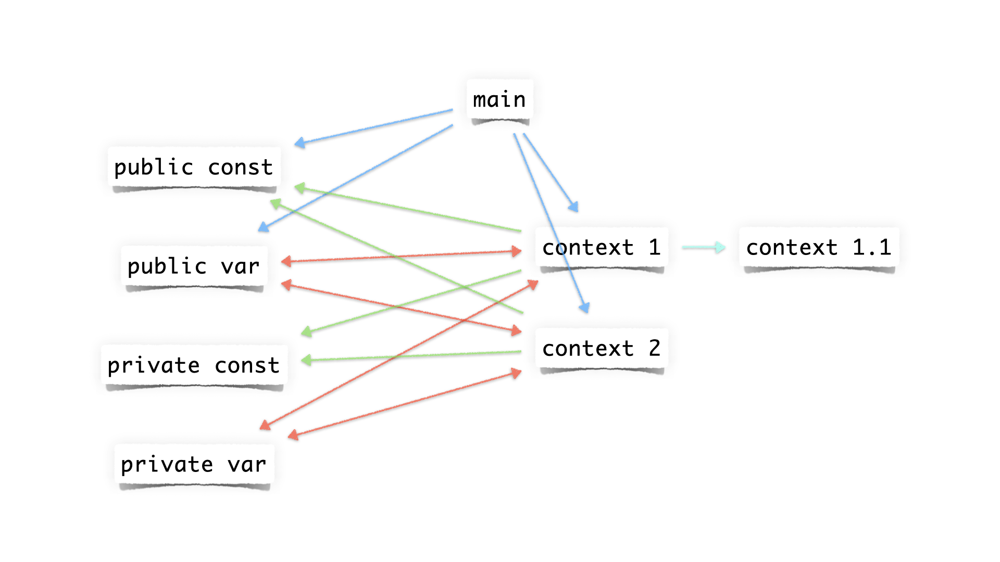

# Paclet and package

References:

* [Paclets and paclet development](https://www.wolframcloud.com/obj/tgayley/Published/PacletDevelopment.nb) `tutorial/Paclets`

---

## Paclet structure

Syntactic dependence:



File structure:

``` text
PacletInfo.wl
Kernel/
    Package.wl
    Package/
        Context1.wl
        Context2.wl
    Constant.wl
    Variable.wl
    Common.wl
    Usage.wl
    ...
...
```

## Package structure

``` wl title="p.wl"
(*set the context as Package`.*)
BeginPackage["Package`"];

(*declare public symbols.*)
Get["Package`Usage`"];

(*load the common subcontext Package`Common`.*)
Get["Package`Common`"];

(*load the definitions of public symbols.*)
Get["Package`Context1`"];
Get["Package`Context2`"];

(*set the private context.*)
Begin["`Private`"];

(*some codes here.*)

(*end the private context and revert to Package`.*)
End[];

(*end the context, and prepend Package` to $ContextPath.*)
EndPackage[];
```

## Symbol types

* Constant - public/private constants.

* Variable - public/private variables.

* Questing function -  define the type of variables. The definition should be complete.

* Main function - implement the functionalities of the package.

* Helper function - assist the main function. The dependency should respect a top-down tree-like structure.

* Formatting function - format the output. It's better to separate the intermediate values passed between functions and the return values.

## Naming convention

* The symbol names should indicate the types, since there is no inbuilt type system in Mathematica, e.g.,

    * questing function `#!wl fooQ`;
    * pattern name `#!wl fooP`;
    * template object `#!wl fooT`;
    * repeated patterns `#!wl foos__`;
    * list pattern `#!wl fooList_`.

* The keys of options and in associations should be capitalized strings.

## Code style

* To prevent unexpected evaluations, define it only when needs to be defined.

* To handle exceptions, define it completely.
