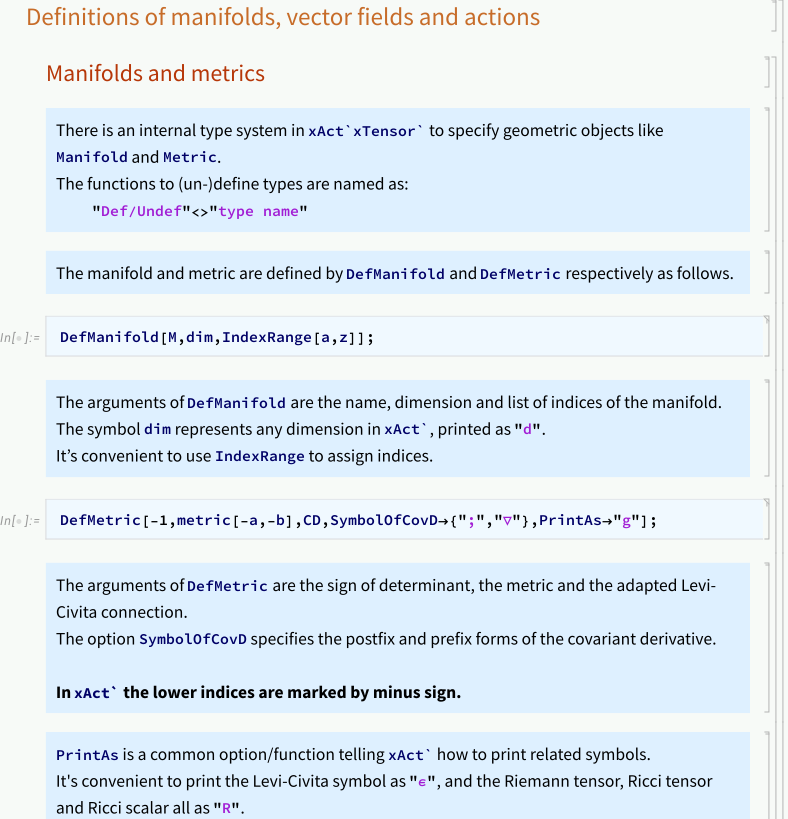

<h1>Introduction to xAct packages
    <span class="subtitle">Equations of motion and stress tensors</span>
</h1>

$\newcommand{\fourpst}{4\partial \text{ST}}$
References:

* xTensor [design pattern](http://www.xact.es/Documentation/HTML/xTensorRefGuide.nb.html) and [documentation](http://www.xact.es/Documentation/HTML/xTensorDoc.nb.html)

* [xTras documentation](http://www.xact.es/xTras/documentation/guide/xTras.html)

* [xAct example notebooks](https://github.com/xAct-contrib/examples)

Materials:

* [xAct-eom-and-emt.nb](xAct/xAct-eom-and-emt.nb)

## Introduction

We introduce the abstract tensor computation functionality of the xAct packages, and illustrate how to derive equations of motions and simplify tensor expressions by the following examples.

<center>

| Theory                                     | Action                                                                                                  |
| :----------------------------------------- | :------------------------------------------------------------------------------------------------------ |
| free scalar                                | $S_{\text{f.s.}}=\frac{1}{2}\int\,{d^{d}x}\sqrt{-g}\,\partial^{a}\phi \partial_{a}\phi$                 |
| conformal scalar                           | $S_{\text{c.s.}}=\frac{1}{2}\int\,{d^{d}x}\sqrt{-g}\,( \partial^{a}\phi \partial_{a}\phi + c R \phi^2)$ |
| abelian gauge field                        | $S_{U(1)}=\frac{1}{4}\int\,{d^{d}x}\sqrt{-g}\,F_{ab}F^{ab}$                                             |
| four-derivative scalar-tensor ($\fourpst$) | $S_{\fourpst}=\frac{1}{4}\int\,{d^{d}x}\sqrt{-g}\,\a(\f) (\partial^{a}\phi \partial_{a}\phi)^2$         |

</center>

The traces $\tr T$ of stress tensors $T_{ab}=\frac{2}{\sqrt{-g}} \frac{\delta S}{\delta g^{ab}}$ of these theories vanish at special dimensions and parameters, then the actions are invariant under the Weyl transformations [@Polchinski:1987dy,@Nakayama:2013is,@Dymarsky:2013pqa,@Luty:2012ww,@El-Showk:2011xbs,@Jackiw:2011vz].

<center>

| Theory           | Trace of stress tensor                                                                             | Condition of Weyl-invariance              |
| :--------------- | :------------------------------------------------------------------------------------------------- | :---------------------------------------- |
| free scalar      | $\tfrac{1}{2} (-2 + d) \nabla_{a}\phi \nabla^{a}\phi $                                             | $d=2$                                     |
| conformal scalar | $\tfrac{1}{2} (-2 + d) \phi \operatorname{EOM}[\f]$ at $c= - \frac{2 -  d}{4 (-1 + d)}$            | $d=2$ or $c= - \frac{2 -  d}{4 (-1 + d)}$ |
| abelian gauge    | $\tfrac{1}{4} (-4 + d) F_{ab} F^{ab}$                                                              | $d=4$                                     |
| $\fourpst$       | $\tfrac{1}{4} (-4 + d) \alpha (\phi) \nabla_{a}\phi \nabla^{a}\phi \nabla_{b}\phi \nabla^{b}\phi $ | $d=4$                                     |

</center>

Notice that:

* only in $d=4$ the free abelian gauge theory is conformally invariant;

* due to the non-minimally coupled term $R \phi^2$, the conformal scalar theory is better behaved than the free scalar theory on curved manifolds.

The variational calculus in this page is purely symbolic: there is no need to specify the global topology of the underlying manifold and the function space [^integral] of the field configurations.
The relevant information involved is a local chart with additional geometrical structures.

At the low-level of computation, the variational calculus is to manipulate expressions according to a list of rules like Leibniz rule and integration by parts (IBP), to reduce the complexity of expressions and to approach to the target expression.
The xAct packages provide a rather complete platform of this functionality.

## The structure of the notebook

The main content is written in [this notebook - xAct-eom-and-emt.nb](xAct/xAct-eom-and-emt.nb):



In the notebook there are four sections to introduce useful functions in the xAct packages:

* Packages and pre-defined functions

    * `#!wl ToCanonical, ContractMetric, Simplification` - simplifying abstract tensorial expressions

* Definitions of manifolds, vector fields and actions

    * `#!wl DefManifold, DefMetric, DefCovD, PD` - defining manifolds, metrics and connections

    * `#!wl DefTensor, DefConstantSymbol, DefScalarFunction` - defining vector fields, constants and scalar functions of fields

    * `#!wl MakeRule` - defining relations between fields

    * `#!wl Scalar, Monomial` - implementing functions on scalars correctly

* Equations of motion and stress tensors

    * `#!wl VarD` - variation and IBP

* Making ansatz

    * `#!wl MakeContractionAnsatz, SolveConstants` - making tensorial ansatz and compare the coefficients

The following useful functionalities are not covered and can be found in [the official documentation](http://www.xact.es/Documentation/PDF/xTensorDoc.nb.pdf):

* `#!wl Validate` - checking xAct syntax like index balancing

* `#!wl CommuteCovDs, SortCovDs` - sorting successive covariant derivatives with the commutators

* `#!wl StrongGenSet, Symmetric` - tensor symmetry

* `#!wl delta, Gdelta` - generalized delta tensor

* `#!wl Dagger, DaggerIndex` - complex vector bundle

* `#!wl LieD, LieDToCovD, Bracket` - Lie derivative

## Some further explanations

The xPert package provides functionalities like variations and metric perturbations.
The function `#!wl Perturbation` has built-in linearity and Leibniz rule. For example, `#!wl Perturbation@A[-a]` is $\delta A_{a}$, printed as $\triangle[A_{a}]$,

The variation of the electromagnetic field action is

``` wl
action[abelianGauge]//Perturbation
```

The variation of three factors in the action are expanded to give three terms

\begin{equation}
\triangle [\cL_{A}]=
\tfrac{1}{4} \bigl(- \frac{F_{ab} F^{ab} \triangle [\overset{\overset{~}{~}}{g}]}{2 (- \overset{\overset{~}{~}}{g})^{1/2}} + (- \overset{\overset{~}{~}}{g})^{1/2} F^{ab} \triangle [F_{ab}] + (- \overset{\overset{~}{~}}{g})^{1/2} F_{ab} \triangle [F^{ab}]\bigr)
\end{equation}

The fundamental field being varied is the gauge potential $A$ instead of the field strength $F$, so we need to expand $F$ by the rule `#!wl ruleFToA`,

``` wl
action[A]/.ruleFToA//tensorSim//Perturbation
```

\begin{equation}
\triangle [\cL_{A}]=
\tfrac{1}{2} \Bigl((- \overset{\overset{~}{~}}{g})^{1/2} \triangle [\nabla^{b}A^{a}] (- \nabla_{a}A_{b} + \nabla_{b}A_{a}) + (- \overset{\overset{~}{~}}{g})^{1/2} \bigl(- \triangle [\nabla_{a}A_{b}] + \triangle [\nabla_{b}A_{a}]\bigr) \nabla^{b}A^{a} -  \frac{\triangle [\overset{\overset{~}{~}}{g}] (- \nabla_{a}A_{b} + \nabla_{b}A_{a}) \nabla^{b}A^{a}}{2 (- \overset{\overset{~}{~}}{g})^{1/2}}\Bigr)
\end{equation}

The variation $\delta A^{a}$ contains metric contraction $\delta(A_{b}g^{ab})=\delta A_{b} g^{ab}+A_{b}\delta g^{ab}$, hence we need to expand $\delta L$ into $(\dots )\delta g+(\dots )\delta A_{a}$. Then the coefficient of $\delta A_{a}$ gives the equation of motion, and that of $\delta g$ gives the stress tensor. There are covariant derivatives in the bracket, which can be eliminated by IBP.

Based on `#!wl Perturbation`, `#!wl VarD[#1,#2]` provides the functionality of extracting coefficients and IBP, where the first argument specifies the variational field and the second one specifies IBP with respect to the covariance derivative `#!wl CD`.

[^integral]: In simple situations the field configurations are assumed to be compactly supported or fast decayed at infinity, ensuring that the integral in the action $S$ is algebraic, aka, is a linear map from field configurations to $\CC$ or $\CC[[\hbar,m,g,\dots ]]$.
